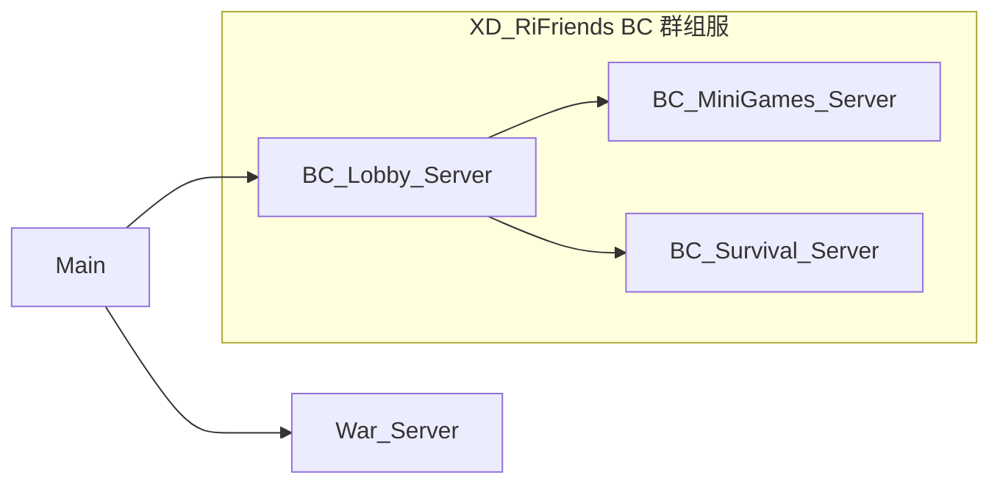

# XD_RiFriends_Files

该库用于存储社群中的知识库文件（流程图、Markdown等），同时在 `README.md` 中发布客户端的下载地址。

### 服务器结构示意图

我们当前拥有两个正在运行的服务器，一个是我们的BC群组服，还有一个是独立的战争服。

```mermaid
graph LR;
    Main-->War_Server
    Main-->BC_Lobby_Server
    subgraph XD_RiFriends BC 群组服
    BC_Lobby_Server-->BC_MiniGames_Server
    BC_Lobby_Server-->BC_Survival_Server
    end
```
### 客户端下载地址

