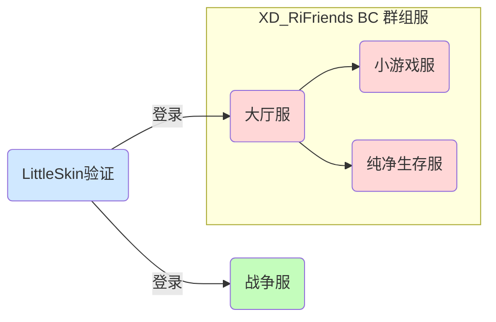

# XD RiFriends 社群发布库

- [XD RiFriends 社群发布库](#xd-rifriends-社群发布库)
  - [社群信息](#社群信息)
  - [Minecraft 社群服务器信息](#minecraft-社群服务器信息)
    - [服务器结构示意图](#服务器结构示意图)
    - [客户端下载地址](#客户端下载地址)
    - [服务器开发进度面板](#服务器开发进度面板)

该库用于存储社群中的知识库文件（流程图、Markdown等），同时在 `README.md` 中发布 Minecraft 客户端的下载地址。当然了，本发布库还会承载 issue(提供问题反馈) 以及 Kanban(开发进度展示) 、Release(客户端发布) 功能。

## 社群信息

- XD RiFriends QQ群：472757785
- [XD RiFriends 开黑啦社群](https://kaihei.co/8L222x)
- [XD RiFriends 社群 Wolai 主页](https://www.wolai.com/siPbgcprsNMv6d5q8RCPsQ)

## Minecraft 社群服务器信息
### 服务器结构示意图

我们当前拥有两个正在运行的服务器，一个是我们的BC群组服，还有一个是独立的战争服。

### 客户端下载地址

群组服客户端：

战争服客户端：

### 服务器开发进度面板

群组服：https://github.com/snjjnlk/XD_RiFriends_Publish/projects/1

战争服：https://github.com/snjjnlk/XD_RiFriends_Publish/projects/2